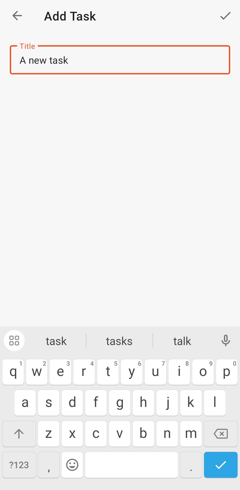

# To-Do List

## Description


Android application programmed in Java language with MVVM architecture that allows user registration and validation through email and password. The authenticated user can add new notes, show a list of notes, update existing notes, delete a specific note or the entire list through the Room library. Design guides with Material Design.

## Features

* Sign Up / Sign In
* Create / Read / Update / Delete

## Technologies

* Java
* Dagger/Hilt
* Room
* Data Binding
* MVVM
* LiveData
* ViewModel
* Material Design
* Navigation Component

## Instalation

1. Clone this repository

```
    git clone https://github.com/lizarragabriel/ToDoList.git
```

## Screens

<table>
    <tr>
        <td></td>
        <td></td>
        <td></td>    
        <td></td>   
        <td></td>
    </tr>
</table>
